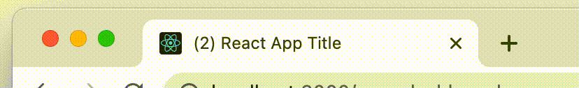

# @teneff/use-title-effect

> React hook for changing document.title
> 
> [![NPM version][npm-img-latest]][npm-url]
> [![Build Status][build-img]][build-url]
> [![Coverage Status][coverage-image]][coverage-url]
> [![GitHub issues][issues-image]][issues-url]
> [![GitHub stars][github-stars-img]][github-stars-url]

## Installation

```sh
yarn add @teneff/use-title-effect
```

## Preview



## Usage

```tsx
import useTitleEffect from '@teneff/use-title-effect'

function App() {

  useTitleEffect('React App Title', {
    messages: ['message 1', 'message 2']
  });

  return (
    <div className="App">
     React App Here
    </div>
  );
}
```

### ℹ️ Consider using the hook in the outer components like App
> Version 1.0.0 does not revert the original title of the page once the component is unmounted

## Options

### `options.title: string` (default: **""**)
Title is used to provide a permanent page title and it's also provided to the formatter to be enchanced

### `options.formatter:` [Formatter&lt;T&gt;](./src/types/Formatter.ts) (default: see [formatter/message](./src/formatter/message.ts))

Formatter is functino accepting object with title and messages and returning array of strings, which are rotated in the given duration

### `options.duration: number` (default: **800**)
Time in milliseconds to switch between the different messages resulted from the formatter

### Usage with custom message format

```tsx
  import formatters, { Formatter } from './formatter';

  const messages = [
    {
      message: 'Hello!',
      author: {
        name: 'John Doe'
      }
    },
    {
      message: 'Hey!',
      author: {
        name: 'Jane Doe'
      }
    },
    {
      message: 'U there?',
      author: {
        name: 'John Doe'
      }
    },
  ]

  useTitleEffect(
    "My awesome app",
    {
      messages,
      // reusing the default formatter
      formatter: ({ title, messages }) => formatters.message({
      title,
      messages: messages.map(message => message.author.name)
    })
  })

  useTitleEffect(
    "My awesome app",
    {
      messages,
      // custom formatter
      formatter: ({ title, messages }) => {
        const uniqueAuthors = new Set(messages.map(message => message.author.name))
        return messages.length ? [
          `(${messages.length}) ${title}`,
          `(${messages.length}) You've got messages from ${Array.from(uniqueAuthors).length} contacts`
        ] : [title]
      }
    });
```

[npm-img-latest]: https://img.shields.io/npm/v/@teneff/use-title-effect/latest.svg?logo=npm&style=flat
[npm-img-next]: https://img.shields.io/npm/v/@teneff/use-title-effect/next.svg?logo=npm&style=flat
[npm-url]: https://www.npmjs.com/package/@teneff/use-title-effect
[build-img]: https://github.com/teneff/use-title-effect/actions/workflows/build.yml/badge.svg?branch=master
[build-url]: https://github.com/teneff/use-title-effect/actions?query=branch%3Amaster
[coverage-image]: https://img.shields.io/codecov/c/github/Teneff/use-title-effect/master.svg?logo=codecov&style=flat
[coverage-url]: https://codecov.io/gh/Teneff/use-title-effect/branch/master
[issues-image]: https://img.shields.io/github/issues/Teneff/use-title-effect/bug.svg?logo=github&style=flat
[issues-url]: https://github.com/teneff/use-title-effect/issues
[github-stars-img]: https://img.shields.io/github/stars/teneff/use-title-effect.svg?logo=github&logoColor=fff
[github-stars-url]: https://github.com/teneff/use-title-effect/stargazers